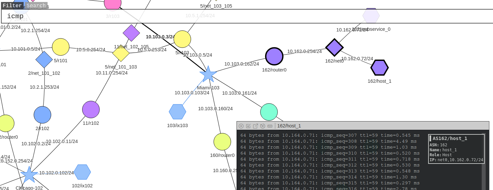
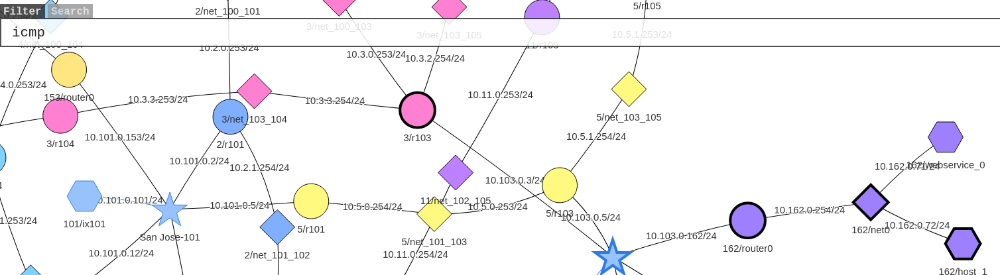

# SEEDlabs: Exam2 - BGP Exploration and Attack Lab

#### Ozgur Ural
#### Student ID: 2564455

### 2 The Lab Setup and the SEED Internet Emulator

First of all, I downloaded the emulator files. Then run the docker with the following commands.
```sh
$ docker-compose build
$ docker-compose up
```

### 3 Task 1: Stub Autonomous System
#### 3.1 Task 1.a: Understanding AS-155’s BGP Configuration

Task 1.a.1:  Find the peer autonomous system of AS-155, find the BGP route of 10.155.0.254/24, and use cat /etc/bird/bird.conf to query its configuration information.


It is known from the routing configuration that AS-150 is interconnected with 3 autonomous systems, of which p_as156 has a peer relationship with it:


Task 1.a.2: AS-155 is interconnected with multiple ASs at the same time, one of which will not affect the AS-155's access to the Internet.

Here we choose to ping the host 10.156.0.72 from 10.155.0.72, and disconnect the links of the BGP routes one by one. If and only when all the links are disconnected, the ping command shows that it is unreachable.


#### 3.2 Task 1.b: Observing BGP UPDATE Messages

Run the following command on the router to store the packets received by the router into a pcap file and transfer them to the virtual machine:

```sh
tcpdump -i any -w /tmp/pgp.pcap "tcp port 179"
```

Cut off a router connected to it, use wireshark to read the pcap file, find the UPDATE MESSAGE of BGP, and see the message that the route exits:


Reconnecting can also capture routing update packets:


#### 3.3 Task 1.c: Experimenting with Large Communities

First cut off the connection between AS-4 and AS-156, and then run the ping command on 10.156.0.71. It is found that 10.155.0.71 can be pinged, but 10.161.0.71 cannot be pinged. Although AS-156 is connected to the Internet through AS-155, due to the relationship between the two peers, AS-155 will not forward the data of AS-156.


Modify the configuration file of the AS-155 router to realize that the data packets of the AS-156 are forwarded through the AS-155. There are two changes in total:

After completing the modification with the following command, 10.156.0.71 can ping 10.161.0.71:

```sh
$ dockps | grep 155
$ docker cp [docker id]:/etc/bird/bird.conf ./as155_bird.conf
$ docker cp ./as155_bird.conf [docker id]:/etc/bird/bird.conf
$ docker exec [docker id] birdc configure
```

#### 3.4 Task 1.d: Configuring AS-180

The experiments in this section need to configure a series of router configuration information to enable AS-180 to access the Internet. Use import bird conf.sh and export bird conf.sh to import and export configuration files in the container.

##### step 1 Connect AS-180 and AS-171
Add the following to the configuration of AS-180 and AS-171 respectively:


##### step 2 Connect AS-180 with AS-2 and AS-3

AS - 180 :  


AS - 2 : 


At this point, the host connected to AS-2 can be pinged:


### 4 Task 2: Transit Autonomous System
#### 4.1 Task 2.a: Experimenting with IBGP

Ping 10.164.0.71 on any host of AS-162 to observe the traffic path. At this time, the ibgp3 of the 3/r103 router is turned off, and the icmp path is interrupted. At this time, the routing information forwarded by 10.103.0.3 will be lost in the routing table of the 162/router0 router.



#### 4.2 Task 2.b: Experimenting with IGP

Use the command disable ospf1 to turn off the opsf protocol of the 3/r103 router, and the icmp path is cut off.



#### 4.3 Task 2.c: Configuring AS-5
Modify the configuration file of AS-5, a total of 3, must check. After changing the configuration, AS-153\AS-160\AS-171 can be switched on.
Modify the configurations of AS-5/r103 and AS-3/r103 so that they can communicate with each other in a peer-to-peer manner.

### 5 Task 3: Path Selection

First check the routing table leading to 10.161.0.0/24 in the BGP router of AS-150:


It can be seen that there are two routing paths to 10.161.0.0/24. They pass through AS-2 and AS-3 respectively. When forwarding routes, the first path will be selected for forwarding. This is because the priorities of the two paths are the same. Forwarding with the shorter AS path is preferred.

```sh
ip root show 100.161.0.0/24
```
Next, modify the routing configuration of AS-150 so that the traffic of AS-150 is forwarded through AS-3, and AS-2 is only used as a backup link. Without modifying the routing configuration,traffic destined for 10.152.0.0/24 will be forwarded by AS-2:

```sh
ip root show 100.152.0.0/24
```

Since the local-preference is preferred when routing, you can adjust the configuration settings.

### 6 Task 4: IP Anycast
A member sends a message to a group of members, and the DNS server adopts this technology.
        
Ping 10.190.0.100 on 10.156.0.71 and 10.160.0.72, and find that the icmp packets of the two hosts have been sent to different destination hosts.

The implementation mechanism of anycast is that the router does not care about the specific location of the destination host, but only cares about the path to the host. The two 10.190.0.100s respectively inform AS-3 and AS-4 of their own locations, and AS-3 and AS-4 spread out. After other routers receive the routing information, they will select the optimal path for forwarding according to the routing algorithm. There is only one forwarding path, so the message can only reach a certain host in 10.190.0.100.

### 7 Task 5: BGP Prefix Attack

Principle: longest route matching principle

#### 7.1 Task 5.a. Launching the Prefix Hijacking Attack from AS-161

Modify the configuration information of AS-161 so that all traffic to AS-154 is transferred to AS-161. The subnet in the configuration needs to cover the entire 10.154.0.0/24:


#### 7.2 Task 5.b. Fighting Back from AS-154

Modify the AS-154 configuration so that it can grab its own traffic:


#### 7.3 Task 5.c. Fixing the Problem at AS-3

Since AS-3 is the only provider of AS-161, AS-3 can modify its own configuration to fix the wrong route:


The configuration of AS-154 has been rolled back here, and it can be found that the traffic is still sent to AS-154 correctly.


