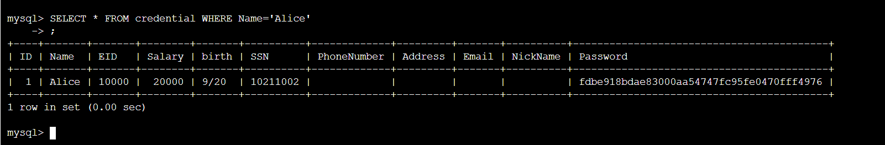
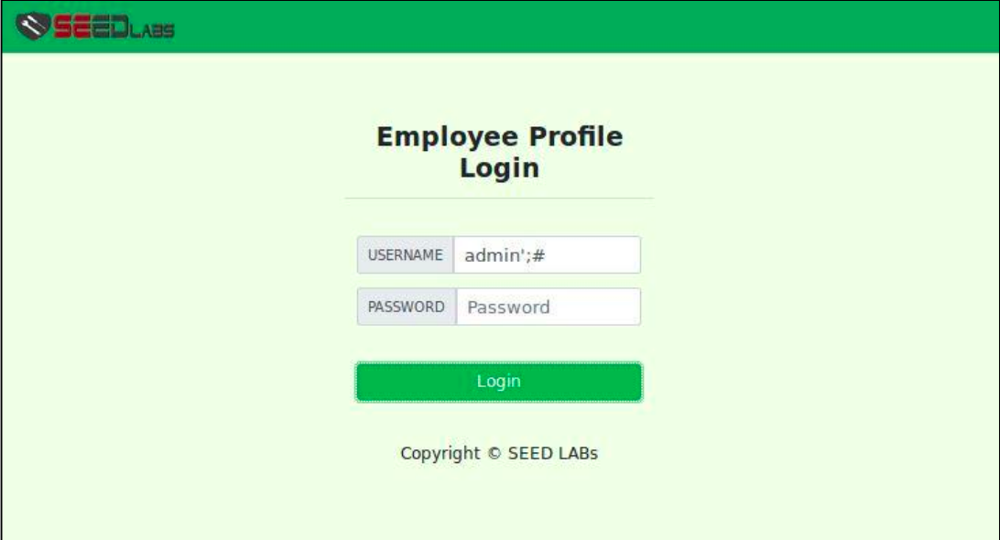
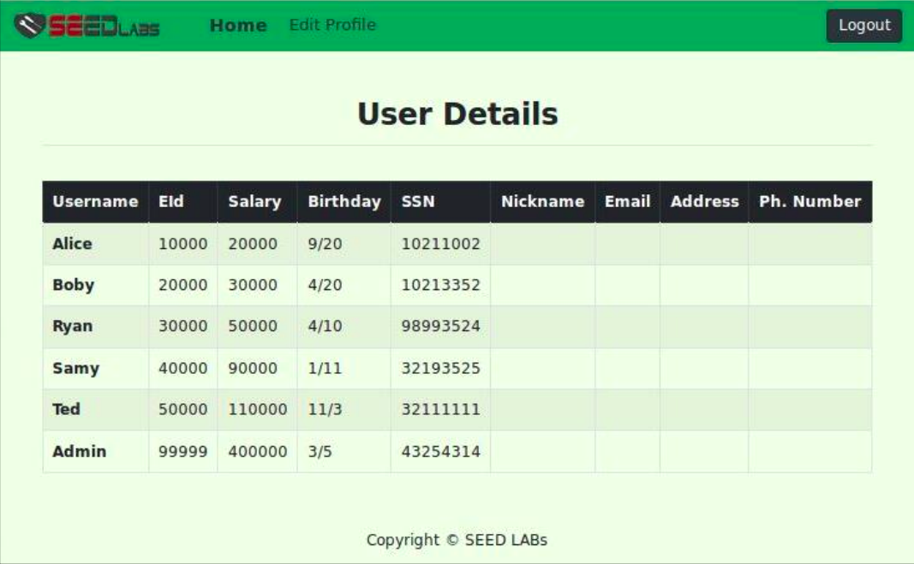
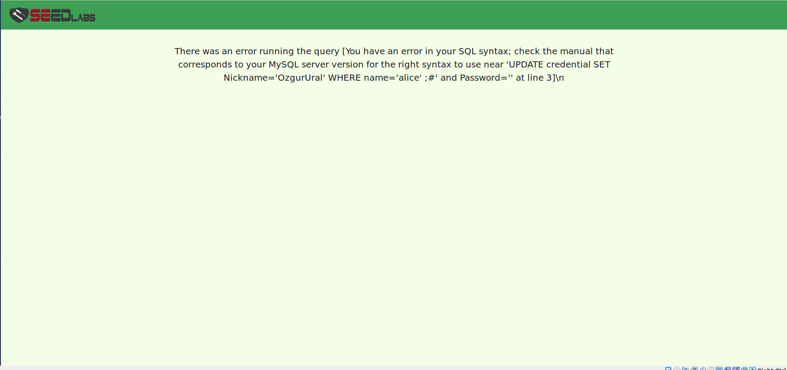
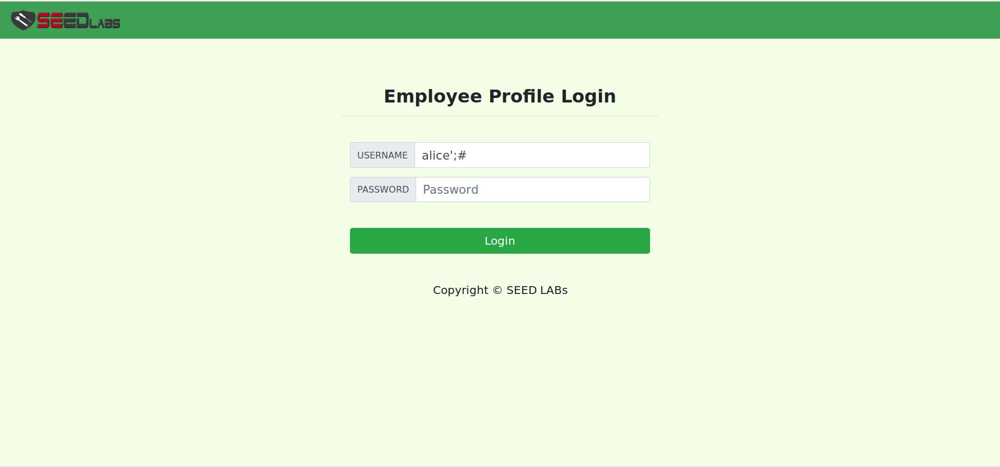
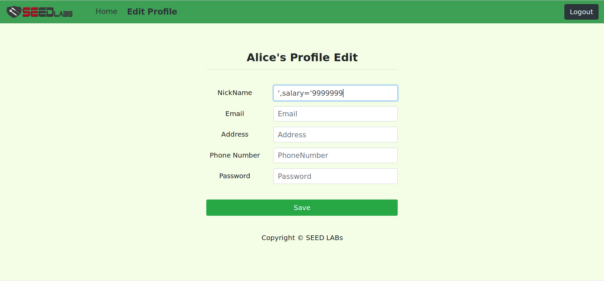
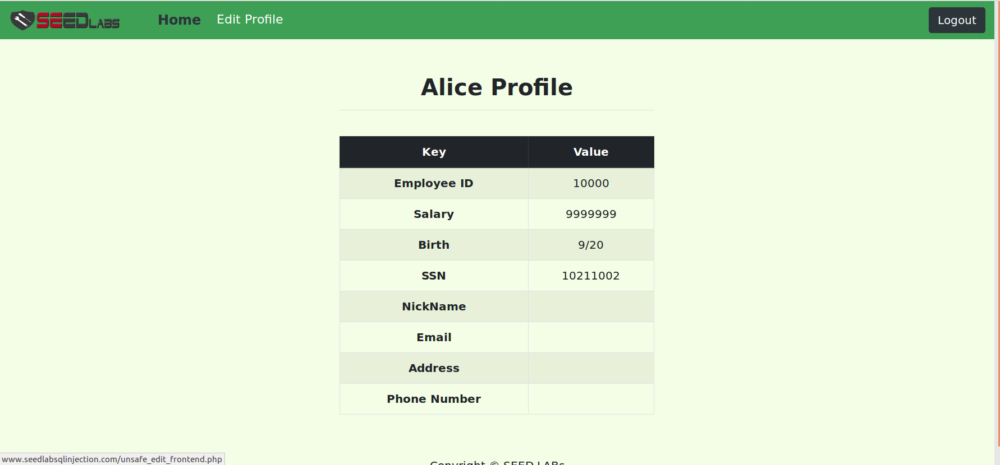
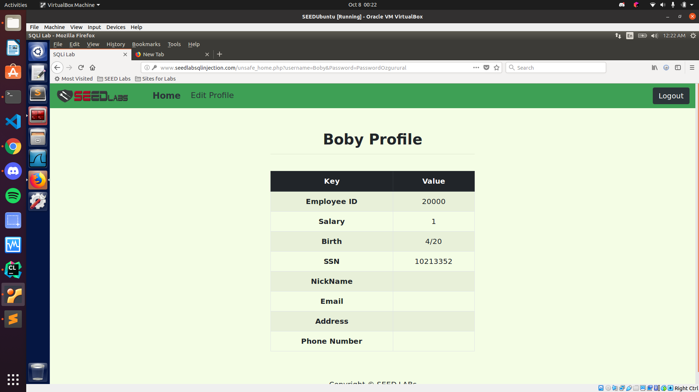
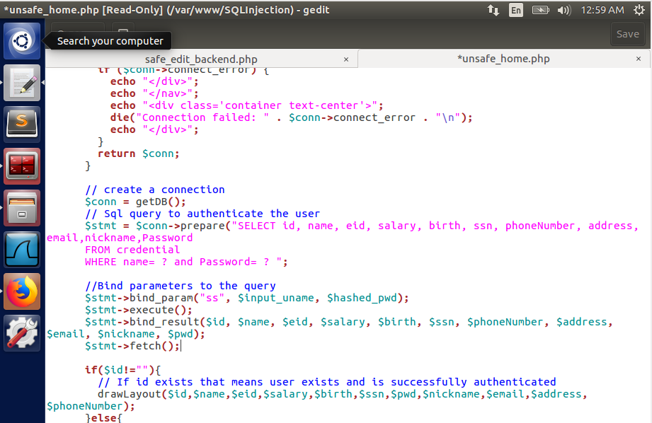
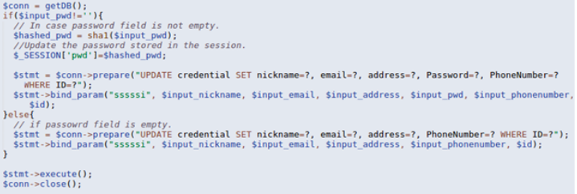

# SEEDlabs: SQL Injection Attack Lab

#### Ozgur Ural
#### Student ID: 2564455

## 3 Lab Tasks

### 3.1 Task 1: Get Familiar with SQL Statements

Console ：
```sh
# mysql -u root -pdees
```
```sh
mysql> use Users;
mysql> show tables;
```

```sh
mysql> use 1;
Database changed
```
Indicates that you can add, delete, modify and query

```sh
mysql> show tables;
```
Shows that we have credential table.

```c
SELECT * FROM credential WHERE Name='Alice'
```



### 3.2 Task 2: SQL Injection Attack on SELECT Statement
#### Task 2.1: SQL Injection Attack from webpage. 
In this task, we need to login into the admin page without knowing any employee’s credential. Figure 1 shows
login to the SQL injection webpage.

Figure 1 

After having logged into the SQL Injection webpage, we can see the details as shown in Figure 2.

Figure 2 


### Task 2.2: SQL Injection Attack from command line 


### Task 2.3: Append a new SQL statement. 
n the above task, we can only steal information from the database; it will be better if we can modify the database using the same vulnerability in the login page. An idea is to use the SQL injection attack to turn one SQL statement into two, with the second one being the update or delete statement. In SQL, semicolon (;) is used to separate two SQL statements. Please describe how you can use the login page to get the server run two SQL statements. Try the attack to delete a record from the database, and describe your observation.

In this task, you first need to show how you tried to perform such an attack. (To be honest, we are unable to achieve the update goal. This is because of a particular defense mechanism implemented in MySQL.) Then, you need to find out from the Internet why the attack fails, what mechanism in MySQL has prevented such an attack. (Hint: this is something related to the mysql query function in the class.user.php code)

I tried the following SQL query to update the statement:

alice'; UPDATE credential SET Nickname='OzgurUral' WHERE name='alice' ;#

However it did not succeed and returned the page shown below:

Figure 3 

Because the protection mechanism of MySql database does not allow multiple statements to be executed, so the injection fails.


## 3.2 Task 2: SQL Injection Attack on UPDATE Statement
### Task 3.1: Modify your own salary
Firstly, I entered the system as Alice with the command below.

Figure 4

Task 3.2: Modify other people’ salary. 
Then, I modify Alice's salary with the command below:

Figure 5

And as you can see in Figure 6, Alice's salary is increased.

Figure 6

Also, af as you can see in Figure 7, Boby's salary is set as 1 dollar. This time we firstly entered the System as Boby and change the salary with the same method explained previously.

Figure 7

### Task 3.3: Modify other people’s password.

```sh
[10/08/22]seed@VM:~$ echo -n PasswordOzgurural > password.txt
[10/08/22]seed@VM:~$ cat password.txt
PasswordOzgurural[10/08/21]seed@VM:~$ 
[10/08/22]seed@VM:~$ sha1sum password.txt
2303012284ca4c22d18b3ac808bfcec68598a020  password.txt
[10/08/22]seed@VM:~$ 
```
Then I enter:

‘, Password=’2303012284ca4c22d18b3ac808bfcec68598a020′ WHERE Name=’Boby’;#

Into the NickName field on Alice’s Edit Profile page.
After I submit it, I log out of Alice’s account and try to log into Boby’s account with the new password (PasswordOzgurural):

Figure 8

## 3.4 Task 4: Countermeasure — Prepared Statement


In this task, firstly I fix the unstafe_home.php, as you can see in Figure 9. Then I fix unsafe_edit_backend.php, as can be seen in Figure 10.



Figure 9



Figure 10

After these fixes, I tried performing one of the SQL injection attacks. I will try to change Alice’s salary from her Edit Profile page. As expected; it was not succeeded.


