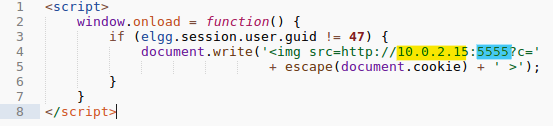
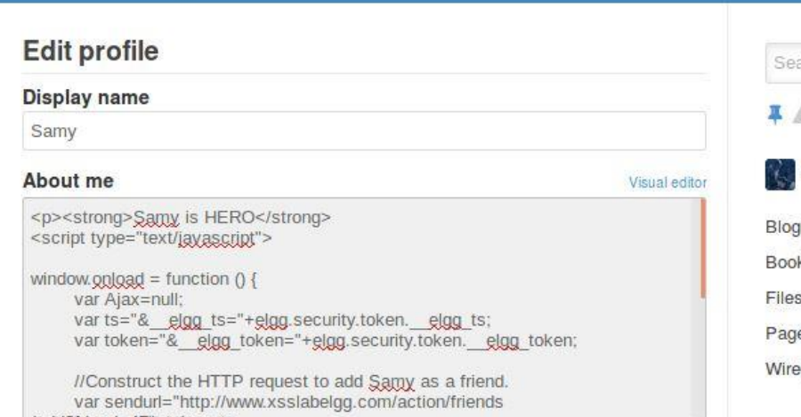
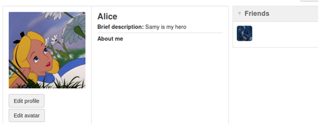

# SEEDlabs: Cross Site Scripting(XSS) Attack Lab

#### Ozgur Ural
#### Student ID: 2564455

## 2 Lab Environment Setup 


Figure 1 

## 3 Lab Tasks

### 3.1 Preparation: Getting Familiar with the "HTTP Header Live" tool

I added the extension to Mozilla Firefox Browser and get familiar as expected.


Figure 2

### 3.2 Task 1: Posting a Malicious Message to Display an Alert Window
The execution result is shown in Figure 3 as can be seen below.  I log in with using the username and password provided in the lab description. After pasting the code, I click save. Once I am back on Samy’s profile page, I see that no alert box popped up. Then I login as Alice. I see that the alert box pops up.


Figure 3

### 3.3 Task 2: Posting a Malicious Message to Display Cookies

I edit my alert.js file I created in the last task to display document.cookie instead of ‘XSS’. On the Attacker VM I edit Samy’s profile. I replace the  script in his About me section with a new one.I save the changes. On the Server VM I am still logged in as Alice and I go to Samy’s profile to see if the new script is working.


Figure 4

### 3.4 Task 3: Stealing Cookies from the Victim’s Machine

To accomplish this, I use a new script:



Figure 5

The part highlighted in yellow is the IP address of the Attacker machine (Samy’s) and the part highlighted in blue is a port number. The port number can be almost any number you want, as long as it isn’t a well-known port.

I edit Samy’s profile and place this new script in the About me section and save it. This script will send an HTTP GET request to the Attacker machines IP address at port location 5555. The Attacker machine needs to have a server listening on this port in order to receive the data (the cookie) being sent to that port. I open a new terminal and use netcat (nc for short) to set up the server.

Over on the Attacker machine, I see that the netcat TCP server has received a connection.


Figure 6

The highlighted part is Alice’s cookie that was sent along with the script’s GET request. The attack was successful and Samy now has Alice’s session cookie.


### 3.5 Task 4: Becoming the Victim’s Friend

Figure 7 shows the guid number and token when we want to add Samy to our friend list. In the HTTP Header Live, we can see the detail of information for adding Samy to the friend list.


Figure 7

Then, we need to write a JavaScript program to send out the same HTTP request. We inject the code in Samy’s profile. Figure 8 shows the code added in the About Me field by clicking “Edit HTML”.



Figure 8

After we have added the code, Samy’s profile should look like what is shown in Figure 9.


Figure 9

When Alice visits Samy’s profile, Alice will add Samy to the friend list (by the code injected in Samy’s profile) as
shown in Figure 10 


Figure 10

### 3.6 Task 5: Modifying the Victim’s Profile

To figure out how Samy would forge a POST request, we need to investigate how the HTTP request would trigger when we edit the profile. 

Figure 11 shows the code added in the About Me by clicking “Edit HTML”.


Figure 11


After visiting Samy’s profile, Alice’s profile will be modified by Samy automatically. Figure 12 shows the modified
Alice’s profile.


Figure 12


### 3.7 Task 6: Writing a Self-Propagating XSS Worm

In this task, we will perform a self-propagating worm to modify the user profile and self-propagating itself to
other user’s profiles. The more users visit a victim’s profile, the more attackers will be. First, we have to inject
the code(worm) to Samy’s profile. When a user visits Samy’s profile, the injected code will execute and modify
a victim’s profile. Second, after the victim visited Samy’s profile, the code will retrieve a copy of it from the DOM
tree of the webpage. Third, when the other user visits the victim, the self-propagate code will duplicate to the
other user and so on. 

After viewing Samy’s profile:



Figure 13

This shows that the script successfully self-propagates and each time a victim views an infected profile.

### 3.8 Elgg’s Countermeasures

## 4 Task 7: Defeating XSS Attacks Using CSP

For this task I first go through the setup instructions in the lab description.

I added lines to /etc/hosts. Then, I run the http_server.py program.
Then I go to each of these URLs provided in the lab document. This task wants me to edit the server program so that fields 1, 2, 4, 5, and 6 display OK when going to the three URLs. 

I added the a line of code to the http_server.py CSP whitelist as explained in the document.

```c
"script-src ’self’ ’nonce-111-111-111’ *.example70.com".
```
Then I navigate back to the three URLs and see if fields 1, 2, 4, 5, and 6 display OK or not. The additions to the http_server.py code worked.
